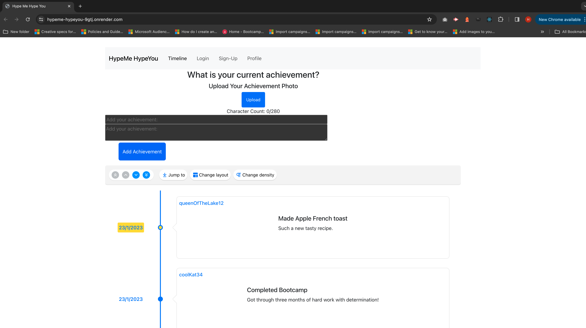
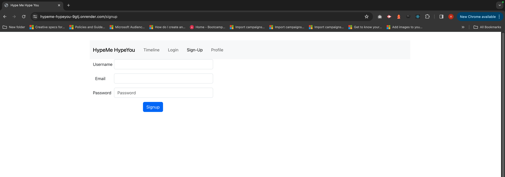
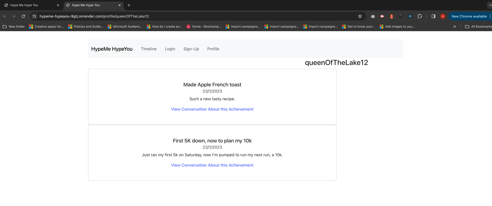

# React + Vite

## Description

- The motivation is to express support for others and their achievements.
- The project was built to create an achievement log for the user.
- The problem this project solves is greater understanding of stripe, introduction of cloudinary and timeline.
- We learned how to work the complete MERN stack.

## Table of Contents (Optional)

- [Installation](#installation)
- [Usage](#usage)
- [Credits](#credits)
- [License](#license)

## Installation

1. Download repo from GitHub repository link:
https://github.com/ThaDarkLord/hypeMe-hypeYou. 

2. Install repo in terminal

3. Use npm i to install all packages needed

4. Change code in VS Code when needed

5. Happy coding!

## Usage

Here's the GitHub link where the repo lives:
[hypeMeHypeYou](https://github.com/ThaDarkLord/hypeMe-hypeYou)

Here's the Render link where the repo lives:
[render](https://github.com/ThaDarkLord/hypeMe-hypeYou)

Here are some screenshots of the app below:

## Credits

We want to thank Leif for helping the backend connection with users and their achievements and comments, as well as with the timeline and the typeDefs and resolvers mutations.

All collaborators on the project:
- Daniel Sykes GitHub: https://github.com/ThaDarkLord
- Austin Clark GitHub: https://github.com/0Clark30
- Harley Sherman GitHub: https://github.com/harleysherman

## License

The license used in this project is MIT License.

---

## Badges

Currently, two official plugins are available:

- [@vitejs/plugin-react](https://github.com/vitejs/vite-plugin-react/blob/main/packages/plugin-react/README.md) uses [Babel](https://babeljs.io/) for Fast Refresh
- [@vitejs/plugin-react-swc](https://github.com/vitejs/vite-plugin-react-swc) uses [SWC](https://swc.rs/) for Fast Refresh 

## Features

The features of this project are listed below:
- Login/ Sign Up
- Authentication throughout front end to back end and vice versa
- Stripe capabilities to allow user to pick a subscription model
- User has the ability to add an achievement with screenshot and comment on other's achievements
- Pre-created data from the MongoDB that mimics real users 

## How to Contribute

For any violations of this project, contact me hello@harleysherman.com.

## Tests

1. Login in a pre-seeded user from the mongoDB
2. Signup a completely new user with username, email, and password
3. Access your profile
4. Add an achievement, just text
5. Add a comment to another's achievement
6. Add a screenshot to your achievement
7. Select a subscription model
8. Click any achievement on the timeline (homepage/ timeline page)